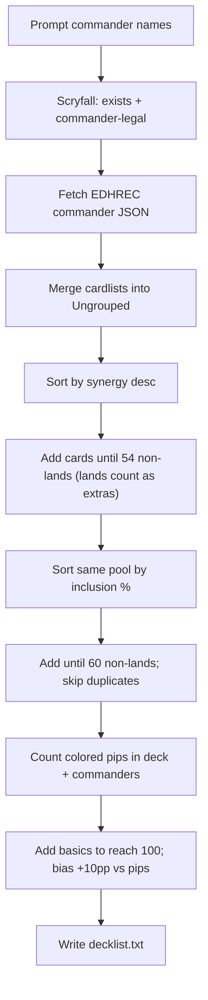

# MTG Commander Deckbuilder (Python)

Greenfield Poetry project (Python 3.12). One CLI entrypoint that prompts for commander(s), builds the list, writes [`decklist.txt`](decklist.txt).

## API verification (live-checked)

### EDHREC — `GET https://json.edhrec.com/pages/commanders/{slug}.json`

Verified with Krenko and Atraxa (HTTP 200). Relevant shape:

- `container.json_dict.card`: `name`, `color_identity`, `legal_commander`, `num_decks`
- `container.json_dict.cardlists[]`: each has `tag`, `header`, `cardviews[]`
- Each `cardview`: `name`, `synergy` (float), `num_decks`, `potential_decks` — **no** precomputed inclusion %; compute `num_decks / potential_decks`
- **No “Ungrouped” endpoint** — the site groups client-side. We synthesize Ungrouped by merging type tags: `creatures`, `instants`, `sorceries`, `utilityartifacts`, `enchantments`, `manaartifacts`, `battles`, `planeswalkers`, `utilitylands`, `lands` (skip duplicate meta lists: `newcards`, `highsynergycards`, `topcards`, `gamechangers`)
- Lands are identifiable by tag (`lands` / `utilitylands`). MDFCs like Valakut Awakening appear under `lands`
- Partners: wrong name order returns `{"redirect":"/commanders/..."}`; correct order returns full payload (`Thrasios, Triton Hero // Tymna the Weaver`)
- Bad slug: **HTTP 403** (S3 Access Denied), not 404 — treat 403/404 as “not found”

Atraxa simulation of the planned passes: synergy → 54 non-lands + 10 lands; inclusion → 60 non-lands + 29 lands (duals/fetches/basics-as-1-ofs); then ~10 remaining slots for extra basics. Confirms duals arrive before the basics step.

### Scryfall — official API

Headers required: `User-Agent` (descriptive) + `Accept: application/json` (without Accept, exact named can 400).

| Endpoint | Use |
| --- | --- |
| `GET /cards/named?fuzzy=` | Resolve commander input |
| `GET /cards/named?exact=` | Precise lookup |
| `POST /cards/collection` body `{"identifiers":[{"name":...}]}` | Batch `mana_cost`, `type_line`, `produced_mana` for the built list |

Validation caveats (verified):

- `legalities.commander == "legal"` alone is **not** enough — Lightning Bolt is legal in Commander but cannot be a commander
- Accept if: `Legendary` + `Creature` in `type_line`, **or** keywords/oracle allow commander (e.g. `Partner` in `keywords`)
- Partners expose `keywords: ["Partner", ...]`

`produced_mana` (verified):

- Mountain → `["R"]`; Breeding Pool → `["G","U"]`; Castle Embereth → `["R"]`
- Command Tower / Exotic Orchard / Path of Ancestry / City of Brass → all five colors (Scryfall’s optimistic “can produce”); fine for “can produce color X within identity”
- Sol Ring → `["C"]` (does not help colored source counts)
- MDFC land side: top-level `produced_mana` still present (Valakut → `["R"]`); `type_line` contains `Land`

### Moxfield import

No API needed. Plain text with `// Commander` / `// Deck` and `qty Name` lines is the import-friendly format we verified against common exporters.

## Data sources (implementation)

- **Scryfall** — validate commanders; batch card metadata via `/cards/collection`
- **EDHREC unofficial JSON** — thin `requests` client (no `pyedhrec`)

Slug: lowercase, strip punctuation, spaces → hyphens. Partners: try both name orders; follow `redirect` when present.

## Algorithm



### 1–2. Input and validation
- Prompt for one name, or two (partners / Friends Forever / Background, etc.).
- Resolve each via Scryfall `GET /cards/named?fuzzy=...`.
- Require `legalities.commander == "legal"` and that the card can be a commander (`is_commander`-style check: legendary creature, or text allowing it / partner / background as applicable). Reject with a clear message and re-prompt.

### 3. EDHREC “Ungrouped”
From `container.json_dict.cardlists`, merge **all** `cardviews` across lists into one pool keyed by card name (dedupe; keep highest synergy / best stats seen). This matches the site’s Ungrouped view.

Skip meta buckets that only duplicate cards already in type lists if needed for cleanliness: prefer type-tagged lists (`creatures`, `instants`, `sorceries`, `utilityartifacts`, `enchantments`, `manaartifacts`, `battles`, `planeswalkers`, `utilitylands`, `lands`) as the source of truth; optionally fold in `highsynergycards` / `topcards` / `gamechangers` / `newcards` only when the name is missing.

Each entry keeps: `name`, `synergy`, `inclusion_pct = num_decks / potential_decks`.

### 4. Synergy pass → 54 non-lands
- Sort ungrouped by `synergy` descending.
- Walk top → bottom. **Add every card** (including lands).
- A card is a land if it came from `lands` / `utilitylands`, or Scryfall `type_line` contains `Land`.
- Stop when **non-land** count reaches **54** (lands already added stay in the deck; they do not count toward 54).

### 5–6. Inclusion pass → 60 non-lands
- Re-sort the **same ungrouped pool** by inclusion % descending.
- Walk top → bottom; skip names already in the deck.
- Same land rule: lands are added; stop when non-land count reaches **60**.

### 7. Basics (+10pp mana generation)
- Deck size target: **100** including commander(s).
  `basics_needed = 100 - len(commanders) - len(mainboard)`.
- Colored pip % from `mana_cost` on commanders + all mainboard cards (ignore generic `{N}`, `{C}`; count `{W/U}`-style hybrid as 0.5 each or 1 per half — use **1 pip per colored symbol character** in the cost string for simplicity: each `{W}`, `{U}`, etc. and each side of hybrid).
- For each existing land, use Scryfall `produced_mana` to count “can produce color X”.
- Target: for each color in the commander’s color identity, aim for roughly `pip_share[color] + 0.10` of **total lands** (existing + basics) able to produce that color. Not strict — allocate basics greedily toward the largest shortfalls within identity; leftover basics go to the highest-pip color. Mono-color: all basics that color.

### 8. Moxfield output
Write [`decklist.txt`](decklist.txt):

```text
// Commander
1 Krenko, Mob Boss

// Deck
1 Sol Ring
...
12 Mountain
```

Format: `// Commander` / `// Deck` section headers, `qty Name` lines (Moxfield’s import-friendly shape).

## Project layout

```
pyproject.toml          # Poetry, python ^3.12, deps: requests
src/mtg_deckbuilder/
  __init__.py
  __main__.py           # python -m mtg_deckbuilder
  cli.py                # prompt + orchestrate
  scryfall.py           # named lookup + collection batch
  edhrec.py             # slugify, fetch, ungroup merge
  build.py              # passes 4–7
  export.py             # decklist.txt writer
README.md               # how to run
.gitignore              # .venv, __pycache__, .env, decklist.txt optional
```

## Notes / defaults
- Rate-limit politely; Scryfall wants ≤10 req/s — collection batch keeps us well under that.
- EDHREC miss → HTTP 403 (or 404); treat as invalid commander page.
- EDHREC may already insert one-of basics (Forest, etc.) during inclusion; the basics step **adds more copies** of those names to fill remaining slots / hit +10pp targets (merge quantities on export).
- No nonbasic land “fixer” beyond synergy/inclusion; basics only fill the remainder.